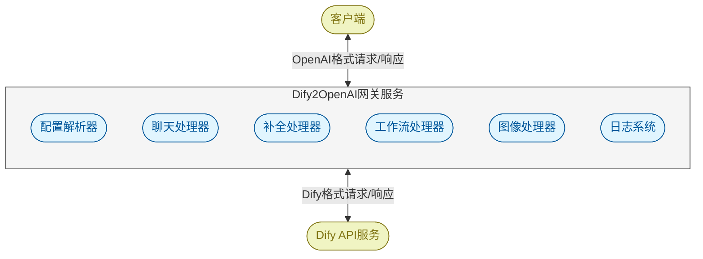
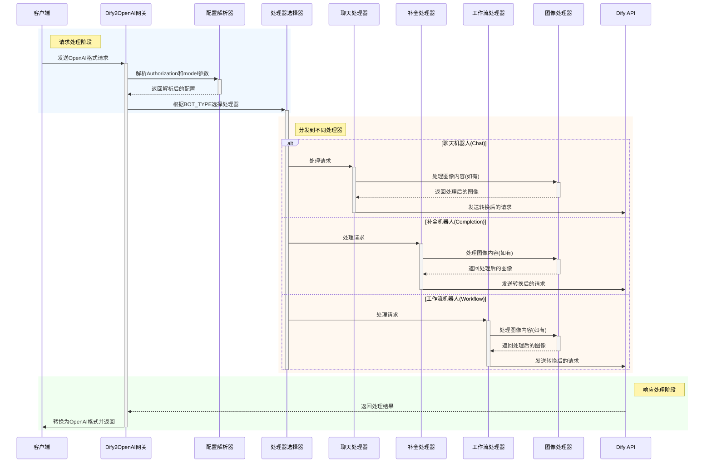
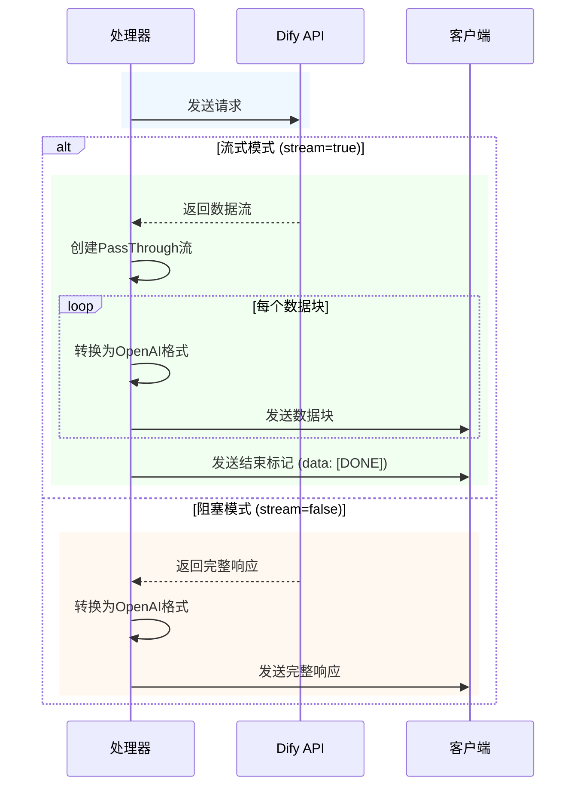
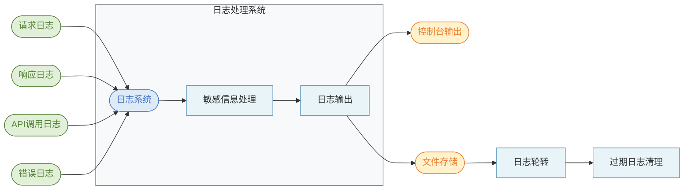
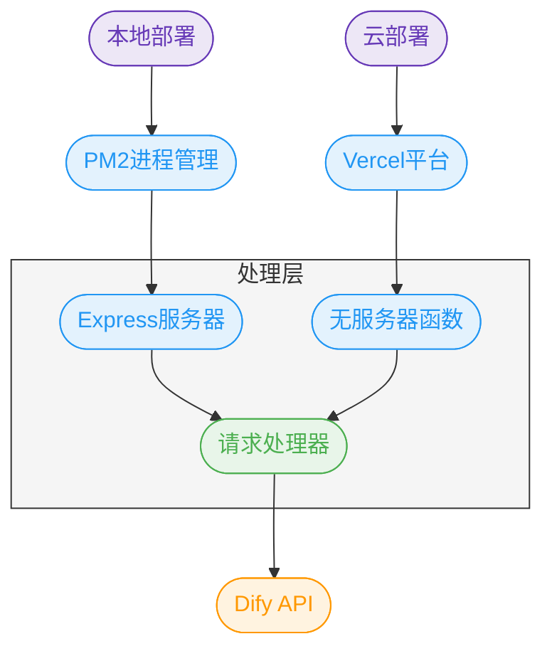

# Dify2OpenAI 运行流程详解

## 项目概述

Dify2OpenAI是一个网关服务，将Dify应用程序转换为OpenAI API兼容的接口，使开发者能够使用熟悉的OpenAI API格式来访问Dify的LLM、知识库、工具和工作流程能力。

## 整体架构



## 请求处理流程



## 配置解析逻辑

系统支持三种不同的配置模式，用于灵活适应不同的集成场景：

```mermaid
flowchart TD
    Start([开始解析]):::start --> CheckAuth{检查Authorization Header}
    
    CheckAuth -->|格式无效| Error([返回错误]):::error
    
    CheckAuth -->|包含多个参数| Method1[方式一:<br>全部在Authorization中]:::method
    Method1 --> Extract1[提取DIFY_API_URL、<br>API_KEY、BOT_TYPE等]:::process
    Extract1 --> Validate
    
    CheckAuth -->|单一参数| CheckParam{检查model参数}
    CheckParam -->|无效| Error
    
    CheckParam -->|有效| CheckValue{检查Authorization值}
    
    CheckValue -->|不含http| Method2[方式二:<br>Authorization是API_KEY]:::method
    Method2 --> Extract2[从model中提取其他参数]:::process
    Extract2 --> Validate
    
    CheckValue -->|含http| Method3[方式三:<br>Authorization是DIFY_API_URL]:::method
    Method3 --> Extract3[从model中提取其他参数]:::process
    Extract3 --> Validate
    
    Validate[验证必要参数]:::process --> Return([返回解析后的配置]):::end
    
    classDef start fill:#d4edda,stroke:#28a745,stroke-width:2px,color:#28a745
    classDef process fill:#e8f4f8,stroke:#4b8bb3,stroke-width:1px
    classDef method fill:#fff3cd,stroke:#856404,stroke-width:1px,color:#856404
    classDef error fill:#f8d7da,stroke:#dc3545,stroke-width:2px,color:#dc3545
    classDef end fill:#d4edda,stroke:#28a745,stroke-width:2px,color:#28a745
```

## 三种不同的接入方式

### 方式一：所有配置在Authorization Header中

使用方式：

```bash
Authorization: Bearer DIFY_API_URL|API_KEY|BOT_TYPE|INPUT_VARIABLE|OUTPUT_VARIABLE
```

### 方式二：Authorization Header传递API_KEY

使用方式：

```bash
Authorization: Bearer API_KEY
"model": "dify|BOT_TYPE|DIFY_API_URL|INPUT_VARIABLE|OUTPUT_VARIABLE"
```

### 方式三：Authorization Header传递DIFY_API_URL

使用方式：

```bash
Authorization: Bearer DIFY_API_URL
"model": "dify|API_KEY|BOT_TYPE|INPUT_VARIABLE|OUTPUT_VARIABLE"
```

## 消息处理流程

```mermaid
flowchart TB
    Start([接收请求]):::start --> Parse[解析消息结构]:::process
    Parse --> ScanImages[扫描图像内容]:::process
    
    ScanImages --> CheckType{图像类型检查}
    CheckType -->|Base64数据| Upload[上传到Dify]:::upload
    CheckType -->|远程URL| Direct[直接使用URL]:::url
    
    Upload --> BuildReq[构建Dify请求]:::process
    Direct --> BuildReq
    
    Parse --> ExtractText[提取文本内容]:::process
    ExtractText --> BuildReq
    
    BuildReq --> CheckMode{是否流式模式}
    CheckMode -->|是| StreamMode[设置流式响应]:::stream
    CheckMode -->|否| BlockMode[设置阻塞响应]:::block
    
    StreamMode --> SendReq[发送到Dify]:::send
    BlockMode --> SendReq
    
    SendReq --> ReceiveResp[接收Dify响应]:::receive
    ReceiveResp --> Convert[转换为OpenAI格式]:::process
    Convert --> Return([返回给客户端]):::end
    
    classDef start fill:#d4edda,stroke:#28a745,stroke-width:2px,color:#28a745
    classDef process fill:#e8f4f8,stroke:#4b8bb3,stroke-width:1px
    classDef upload fill:#e6c3e6,stroke:#8e44ad,stroke-width:1px,color:#8e44ad
    classDef url fill:#c3e6cb,stroke:#155724,stroke-width:1px,color:#155724
    classDef stream fill:#b8daff,stroke:#004085,stroke-width:1px,color:#004085
    classDef block fill:#ffeeba,stroke:#856404,stroke-width:1px,color:#856404
    classDef send fill:#d6d8d9,stroke:#1b1e21,stroke-width:1px,color:#1b1e21
    classDef receive fill:#f5c6cb,stroke:#721c24,stroke-width:1px,color:#721c24
    classDef end fill:#d4edda,stroke:#28a745,stroke-width:2px,color:#28a745
```

## 图像处理逻辑

```mermaid
flowchart TB
    Start([检测到图像]):::start --> CheckType{图像类型?}
    
    subgraph Base64处理 [Base64图像处理流程]
        direction TB
        style Base64处理 fill:#f0f0ff,stroke:#8080ff,stroke-width:1px
        ParseData[解析base64数据]:::process --> ExtractMime[提取MIME类型]:::process
        ExtractMime --> CreateBuffer[创建文件Buffer]:::process
        CreateBuffer --> CreateForm[创建FormData]:::process
        CreateForm --> Upload[上传到Dify]:::upload
        Upload --> GetFileId[获取文件ID]:::process
    end
    
    subgraph URL处理 [URL图像处理流程]
        direction TB
        style URL处理 fill:#f0fff0,stroke:#80ff80,stroke-width:1px
        ExtractExt[提取文件扩展名]:::process --> DetermineType[确定文件类型]:::process
    end
    
    CheckType -->|Base64| Base64处理
    CheckType -->|URL| URL处理
    
    GetFileId --> AddToReq([添加到请求中]):::end
    DetermineType --> AddToReq
    
    classDef start fill:#d4edda,stroke:#28a745,stroke-width:2px,color:#28a745
    classDef process fill:#e8f4f8,stroke:#4b8bb3,stroke-width:1px
    classDef upload fill:#e6c3e6,stroke:#8e44ad,stroke-width:1px,color:#8e44ad
    classDef end fill:#d4edda,stroke:#28a745,stroke-width:2px,color:#28a745
```

## 响应处理流程



## 日志系统



## 部署架构



## 总结

Dify2OpenAI网关服务通过巧妙的转换机制，使得开发者能够用统一的OpenAI API格式来调用Dify的各种能力，极大地简化了开发流程和集成难度。系统支持多种配置方式和机器人类型，能够灵活适应不同的应用场景需求。
